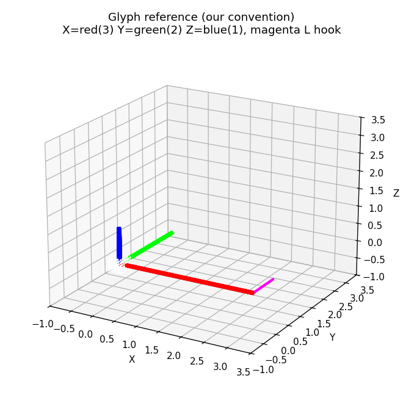
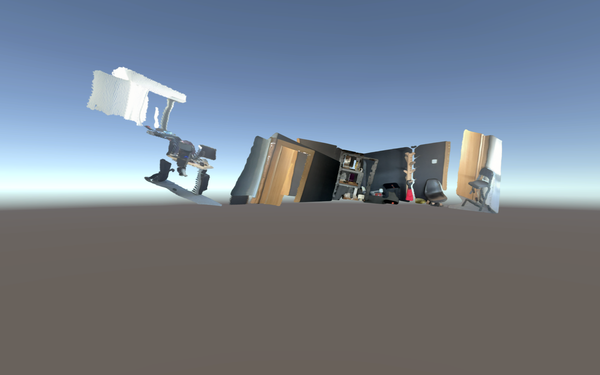
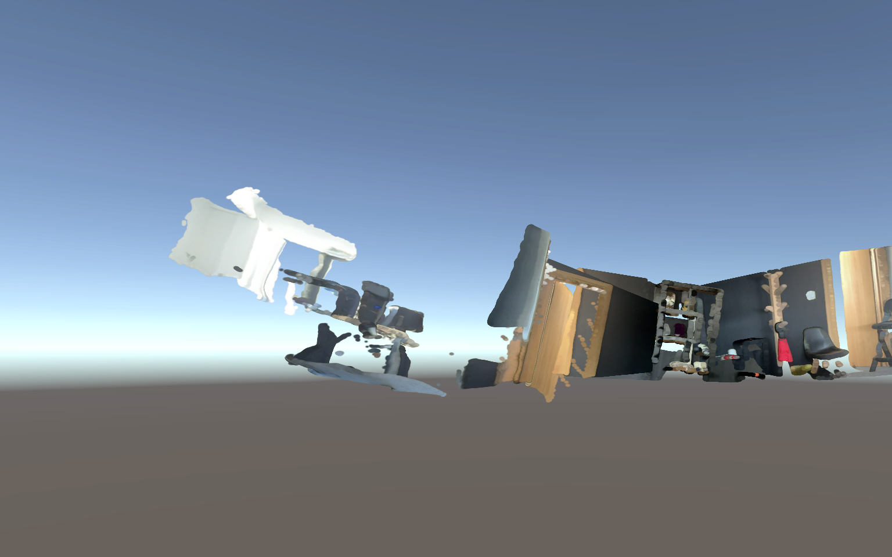

# Coordinate-System Conversion for the CV Viewer

Convert the provided `image1-3.ply` + `traj.txt` from their source coordinate system
into the one the Unity viewer expects, so the scene renders as one coherent, upright,
un-mirrored room. The exact source→viewer transform is not specified — finding it is
the assignment. This README grows phase by phase as the search progresses.

## Setup — create the pristine source once

Place this `solution\` folder directly inside the viewer build root (next to
`ComputerVisionAssignment.exe` and `ComputerVisionAssignment_Data\`). The pipeline
**reads** its inputs from a `data_original\` folder at that root and only ever
**writes** into `StreamingAssets\`. A fresh build ships the originals inside
`StreamingAssets`, so copy them out once into `data_original\` before running:

```
mkdir data_original
copy ComputerVisionAssignment_Data\StreamingAssets\Points\image1.ply data_original\
copy ComputerVisionAssignment_Data\StreamingAssets\Points\image2.ply data_original\
copy ComputerVisionAssignment_Data\StreamingAssets\Points\image3.ply data_original\
copy ComputerVisionAssignment_Data\StreamingAssets\traj.txt          data_original\
```

`data_original\` is the read-only source of truth: every phase reads from it and only
`StreamingAssets\` is overwritten, so the originals are always safe and the scene can be
restored at any time by copying `data_original\*` back over `StreamingAssets\`.

## How to run

```
uv venv delta_venv --python 3.12
uv pip install --python delta_venv\Scripts\python.exe numpy open3d opencv-python matplotlib
delta_venv\Scripts\python.exe solution\phase_a1_a2.py
delta_venv\Scripts\python.exe solution\phase_a3.py
delta_venv\Scripts\python.exe solution\ply_writer.py
delta_venv\Scripts\python.exe solution\phase_c.py preview
delta_venv\Scripts\python.exe solution\phase_c.py downsample
delta_venv\Scripts\python.exe solution\phase_d.py 1
delta_venv\Scripts\python.exe solution\phase_d.py 2
delta_venv\Scripts\python.exe solution\phase_e.py
delta_venv\Scripts\python.exe solution\phase_f.py 20
delta_venv\Scripts\python.exe solution\phase_f.py
```

`uv`[^13] manages the virtual environment; open3d[^2] ships no Python 3.13 wheels, hence
the pinned 3.12 env.

`phase_c.py` takes a mode: `preview` renders a local PNG, `downsample` stages the
CP1 check into the viewer (see below), and no argument runs both. `phase_d.py` takes a
run number (1 or 2) selecting which probe to stage. `phase_f.py` takes an optional
integer N to use every Nth point for a fast preview (default 1 = full-res). The phases
that stage into the viewer (`phase_c downsample`, `phase_d`, `phase_f`) overwrite
`StreamingAssets\`; copy `data_original\*` back to return to the untouched scene.

## Checkpoints (CP0–CP3) — when to relaunch the viewer

A **checkpoint (CP)** is a deliberate stopping point at which you launch
`ComputerVisionAssignment.exe` and read the real render before moving on. The viewer is
the only trustworthy oracle (Phase D), so every checkpoint is a *look with your own eyes*
gate: if the scene is right, the one thing changed since the previous checkpoint is sound;
if it's wrong, the bug is localised to exactly that step. The ladder builds from "nothing
touched" up to the final geometry:

- **CP0 — untouched originals.** The pristine `data_original\*` staged in `StreamingAssets\`.
  The baseline scene every later checkpoint is compared against. Relaunch to confirm the
  starting state before any math is applied.
- **CP1 — Phase C `downsample`.** Every 100th point written through the Phase B writer,
  `traj.txt` untouched. Transforms *nothing* — a pure I/O test. Relaunch: you should see
  CP0's scene, just sparser. If it's corrupt or won't load, the bug is in the writer.
- **CP2 — Phase D Run 1 (`phase_d.py 1`).** The calibration glyph in all three slots with
  identity poses. Relaunch and read off the glyph's orientation to measure `V_pt` (the
  viewer's point map — it negates Y).
- **CP3 — Phase D Run 2 (`phase_d.py 2`).** The glyph with `[identity, translation, Rx90]`
  poses. Relaunch to measure `F` (how a traj line becomes a Unity transform — verbatim,
  no hidden inversion).

The final export (Phase F) is verified against CP0 and the reference image the same way:
relaunch and confirm the room is coherent. Restore CP0 at any time by copying
`data_original\*` back over `StreamingAssets\`.

## Phase A — what the input files are

Before transforming anything, establish with evidence what was provided.

- **A1 — `traj.txt` is row-major 4×4 homogeneous poses.** The 3 lines × 16 floats only
  fit a 4×4 matrix, and only the row-major reading yields an orthonormal `R` (det +1)[^8],
  a `0 0 0 1` bottom row, *and* a nonzero translation column. The column-major reading
  collapses every translation to zero — invalid. So the data is clean rigid transforms;
  the problem is purely a convention mismatch, nothing is corrupted.
- **A2 — the poses are camera-to-world.[^6]** Composing `world = M · p` interlocks the three
  clouds into one room (coherence ratio 1.64); the inverse `M⁻¹ · p` scatters them
  (2.45). So each cloud's pose places its camera-local points into the shared world.
- **A3 — an attempt at the vertical that later turned out to be wrong.** `phase_a3.py`
  argues the vertical two ways: (1) the camera's optical axis is local Z[^4] (every point
  has positive local Z — a camera can't see behind itself), so step × view gives the
  remaining perpendicular axis, ≈ `[-0.13, +0.978, +0.166]`; (2) a floor-slab test on the
  world-placed points, which picks the same axis. Both were run **before Phase E found the
  re-aim convention `C`**, so both describe the placement `M · p` — not the coherent world
  `M · C · p` that the solution actually exports. Re-measured in that world, this vector is
  **horizontal** (it is essentially the wall normal), not the vertical.

  The mistake is worth keeping visible because it survived two rounds of review: "two
  independent methods agree" is much weaker than it sounds when both consume the same
  unvalidated assumption about which local axis is the optical axis. The vertical is now
  *measured from the scene geometry* in Phase F, and checked against ground truth that owes
  nothing to the poses — see **What broke, and how it was caught** below.

## Phase B — PLY I/O primitive

Before transforming any data, establish a writer that produces files the viewer's
unknown parser will accept without complaint.

- **B — header-faithful ASCII PLY writer.** The viewer's PLY parser is a black box
  (closed Unity build). The safest strategy is to clone the original header byte-for-byte
  — same property names, same types, same line endings, only the `element vertex` count
  rewritten — and emit data rows in the exact same `x y z r g b` format, following the
  PLY specification[^1]. A round-trip self-test (write → re-read with open3d[^2]) confirms
  coordinates are preserved to 1e-5 and colors are bit-exact. All later phases write
  converted clouds through this function, so any format problem surfaces here before
  touching the viewer.

## Phase C — fast iteration and the CP1 checkpoint

The full clouds are ~3M points each, so the viewer loads them in minutes. Every
geometry experiment would be unbearable at that speed, and a wrong guess is hard to
diagnose when each look costs minutes. Phase C fixes both with two tools and the
first rung of a checkpoint ladder.

- **`preview` — the local microscope.** Composes `world = M · p` in numpy[^14] and draws
  three fixed viewpoints to a PNG in seconds, no Unity. It renders *our current
  belief* about placement, so it is for fast iteration only, never the final verdict —
  only the real viewer certifies "done". An optional correction `D` can be passed to
  preview a candidate transform before committing it.
- **`downsample` — the CP1 I/O checkpoint.** Writes every 100th point (~30k/cloud)
  through the Phase B writer into the viewer's `StreamingAssets\Points\`, leaving
  `traj.txt` untouched. It transforms *nothing*: CP1 is purely an I/O test. Relaunch
  the viewer and you should see the **same scene as the untouched originals (CP0)**,
  just sparser and orbiting fast. If CP1 looks corrupted or won't load, the bug is in
  the writer — caught here, before any coordinate math is in play.

This is the discipline for the whole solution: each step is gated by a viewer
checkpoint, so a regression is localised to the one thing that changed since the last
green check. CP0 = untouched originals; CP1 = downsampled, same scene; later
checkpoints add the geometry. Reading `data_original\` only and writing
`StreamingAssets\` only, the pristine originals always remain the restore source.

## Phase D — measuring the viewer (the glyph probe)

The viewer is a closed Unity build[^11]: its PLY loader and pose handling are a black box,
and an earlier attempt proved that decompiled code does not reveal transforms baked
into the scene. The only trustworthy oracle is what the viewer actually renders. So
before solving anything, *measure* the viewer by feeding it an object whose correct
appearance is known in advance and reading the result off the screen.

- **D — axis-triad calibration glyph.** `phase_d.py` builds a synthetic glyph: a white
  origin blob with three colored arms (+X red length 3, +Y green length 2, +Z blue
  length 1) and an asymmetric magenta "L" hook at the tip of +X. The colors say which
  axis went where, the lengths are a backup signal, and the asymmetric hook distinguishes
  a true rotation from a mirror (a reflection that imitates a rotation flips the L
  visibly)[^10]. It is staged into all three cloud slots and run twice:
  **Run 1 (`phase_d.py 1`, CP2)** uses identity poses on all three traj lines and measures
  `V_pt` — the total map the viewer applies to point coordinates (it negates Y).
  **Run 2 (`phase_d.py 2`, CP3)** uses `[identity, pure translation, pure Rx 90°]` and
  measures `F` — how a traj line becomes a Unity transform (it uses the poses verbatim,
  no inversion or hidden rotation)[^12]. These two measurements are what the final export
  must pre-compensate for; a local reference PNG of the glyph is written to `probes\` so
  you know what "no transform" should look like before reading the viewer:

  

## Phase E — finding the re-aim convention

Each PLY point is in the camera's local coordinate system. To place it in the shared
world via `world = M · p`, the point's axes must be expressed in the same convention
that M was written in. The wrong convention makes clouds that shear, mirror, or scatter
instead of assembling into one room. The assignment gives no hint which convention is
correct, so the approach is to measure it directly from the data.

- **E — photo-consistency search over all 48 axis conventions.[^10]** A 3D point from cloud i,
  re-projected into camera j's image through `K · C⁻¹ · Mⱼ⁻¹ · Mᵢ · C · p`[^4][^5], must
  land on the same-coloured pixel that camera j recorded — if and only if C is correct.
  Wrong C re-projects onto unrelated pixels, so colour disagrees. This makes C a
  measurable quantity, not a guess. The intrinsics (fx, fy, cx, cy) are also recovered
  from the data: the PLYs are one-point-per-pixel (2533 × 1170 = 2,963,610 vertices), so
  pixel index → (u, v) and a linear regression[^7] of u ~ x/z gives fx, cx at R² = 1.0000
  — no assumed values (fx = −1672.5, cx = 1267.0; fy = −1661.2, cy = 588.5). The negative
  focal signs are themselves a measurement: they say the points' local +x runs left and
  local +y runs **up** in the image, which Phase F later uses to fix the sign of the
  vertical.

  Running the reprojection across all 48 signed-axis permutations (ε = 0.14) gives a
  result that no single column decides:

  | C | reprojected | median 3D dist | coincide % | colour % |
  |---|---|---|---|---|
  | `+X,+Z,+Y` | 325278 | **0.146** | **49.4%** | 44.8% |
  | **`−X,−Z,−Y`** (shipped) | 168076 | 0.174 | 45.7% | 81.7% |
  | `+Z,−X,+Y` | 183608 | 0.299 | 43.3% | **86.2%** |

  `+X,+Z,+Y` leads on raw coincidence and on median distance, but its colour agreement
  collapses to 44.8% — it is stacking surfaces that are geometrically near each other but
  are not the same surface, the classic photo-consistency false positive. Conversely
  `+Z,−X,+Y` wins on colour alone. **`−X,−Z,−Y` is the only candidate that is strong on
  all three**, and it is the one the viewer confirms. Reporting "81.7%" as a coincidence
  score, as an earlier draft of this file did, overstates how cleanly the metric decides:
  the search narrows 48 candidates to 3, and the viewer picks among those.

## Phase F — export

With C known (Phase E) and the viewer's point/pose maps measured (Phase D), the
world-bake formula `w = M · C · p` places every cloud into the shared world. The poses
are then replaced by identity matrices so the viewer sees one pre-composed scene with no
per-cloud transform applied. A final orientation rotation D stands the room upright.

**What D has to satisfy.** The export writes `f = V_pt · (D · (V_pt · w − c₀) + c₀)`, and
the viewer applies its own `V_pt` on load. Since `V_pt · V_pt = I`, the rotation the viewer
actually shows is

```
displayed = D · V_pt · w + const
```

so D is exactly the matrix that must send the room's true vertical to Unity's +Y **under
that composition** — nothing more. Two consequences worth stating plainly: `det(D · V_pt)
= −1`, i.e. the pipeline contains exactly one reflection, which is correct and necessary
because the source PLY frame is right-handed (x left, y up, z forward — read off the
negative focal signs in Phase E) while Unity is left-handed[^11]; and D is **not**
near-identity for this dataset (`max|D − I| ≈ 1.98`), because the measured vertical is
nowhere near the world's +Y axis.

- **F — world-bake, oriented, full-resolution export.** `phase_f.py` applies C, then
  *measures* the vertical from the scene rather than inferring it from camera motion.
  `wall_normal()` finds the dominant plane's normal by iterating its surface-normal
  cluster to a fixed point, seeded from the cameras' own optical axis (under C that is
  `−R[:,1]`) because the cameras face the wall; the iteration is only locally convergent,
  so that seed is load-bearing — random seeds settle on side walls with a tenth of the
  support. `scene_up()` then takes the common perpendicular of that normal and the camera
  path, which is the vertical because walls are vertical and the rig moved horizontally,
  and fixes the sign from the cameras' image-up axis (`−R[:,2]`). D is the minimal proper
  rotation[^9] mapping `V_pt · up` to +Y[^11].

  The measurement is self-checking: the dominant plane comes out 89.4° off the camera path
  and 90.00° off the derived up — a genuinely vertical wall parallel to the rig's motion —
  and it places the cameras 1.18 above the floor in a room 2.15 tall, which is a plausible
  handheld capture. The measured up is `(−0.012, −0.398, 0.917)` and `D · V_pt · up`
  comes out as +Y to machine precision.

  All three clouds are processed at full resolution (~2.9 M points each), with only a
  gentle statistical outlier removal (std 2.0)[^3] to kill isolated specks without
  amputating wall geometry. The output is three replacement PLYs plus an identity traj.txt
  in `StreamingAssets\`. Relaunch the viewer to see the result.

## What broke, and how it was caught

The first version of this solution exported a room that was **coherent but lying on its
side**. Everything upstream was right — the clouds interlocked, the colours matched, the
walls were solid — and exactly one thing was wrong: which direction was up.

| | |
|---|---|
|  |  |
| **Before.** The furniture wall renders on its side. | **After.** Doors, wall panels and chair stand vertical. |

The orientation had been derived twice, by two different arguments, and **both were
wrong**:

- `phase_f.py` used the **pan axis** — the eigenvector of the pairwise camera rotations —
  on the assumption that a camera panning across a room rotates about the vertical.
  Measured against ground truth, that axis points **downward** and is 22° off-axis. The
  rig was handheld, not on a tripod: it rolled as much as it panned.
- Phase A3 used **step × view**, and the README claimed it was corroborated by a
  floor-slab test. Both were computed before Phase E found `C`, so both describe `M · p`
  rather than the coherent world `M · C · p`. In the world the solution actually exports,
  that vector is **horizontal** — it is roughly the wall normal.

A third error sat on top: a `diag(1, −1, −1)` prefactor multiplied into D as a
"pre-compensation" for the viewer's Y-negation. But the viewer's `V_pt` already appears
in the composition `D · V_pt`, so the prefactor was a second, redundant flip. Removing it
alone would not have fixed anything — with the pan axis still feeding D, the room merely
moves from one wrong orientation to another.

**What settled it** was a test that owes nothing to the poses. The PLYs are one point per
pixel in row-major order (Phase E), so pixel row `v` increases *downward* in the original
photograph. A correct up-vector must therefore anti-correlate with world height. Running
that correlation over all three clouds:

| candidate up | image1 | image2 | image3 | verdict |
|---|---|---|---|---|
| measured (wall × camera path) | −0.804 | −0.975 | −0.964 | correct |
| Phase A3 `step × view` | −0.082 | +0.635 | +0.381 | horizontal — not a vertical |
| `phase_f` pan axis | +0.695 | +0.944 | +0.968 | **inverted** |

The lesson is the one this whole solution is built on, applied one level deeper than
before: *the viewer is the only trustworthy oracle, and a derivation that has never been
checked against measured ground truth is a hypothesis, not a result.* Two independent
derivations agreeing is not corroboration when both inherit the same unvalidated
assumption — here, which local axis is the optical axis. The fix replaces both with a
direct measurement of the scene's own geometry, cross-checked three ways (wall
perpendicularity, camera height consistency, and the pixel-row correlation above) and
then confirmed in the viewer.

## References

[^1]: PLY polygon file format specification — Paul Bourke: <http://paulbourke.net/dataformats/ply/>
[^2]: Open3D documentation (PLY read/write, point clouds, Python 3.12 wheels): <https://www.open3d.org/docs/release/>
[^3]: Open3D statistical outlier removal tutorial: <https://www.open3d.org/docs/release/tutorial/geometry/pointcloud_outlier_removal.html>
[^4]: Pinhole camera model — Wikipedia: <https://en.wikipedia.org/wiki/Pinhole_camera_model>
[^5]: Camera calibration & intrinsic matrix — OpenCV docs: <https://docs.opencv.org/4.x/dc/dbb/tutorial_py_calibration.html>
[^6]: Perspective projection / camera-to-world transforms — Scratchapixel: <https://www.scratchapixel.com/lessons/3d-basic-rendering/computing-pixel-coordinates-of-3d-point/mathematics-computing-2d-coordinates-of-3d-points.html>
[^7]: Least-squares fitting (intrinsics regression) — `numpy.linalg.lstsq`: <https://numpy.org/doc/stable/reference/generated/numpy.linalg.lstsq.html>
[^8]: Rotation matrix — axis of rotation as the eigenvector with eigenvalue 1 — Wikipedia: <https://en.wikipedia.org/wiki/Rotation_matrix>
[^9]: Rodrigues' rotation formula — the minimal rotation aligning two vectors — Wikipedia: <https://en.wikipedia.org/wiki/Rodrigues%27_rotation_formula>
[^10]: Rotation formalisms — proper (det +1) vs improper rotations, signed-axis permutations — Wikipedia: <https://en.wikipedia.org/wiki/Improper_rotation>
[^11]: Unity left-handed Y-up coordinate system — Unity `Transform` manual: <https://docs.unity3d.com/Manual/class-Transform.html>
[^12]: Unity pose handling — `Quaternion` scripting reference: <https://docs.unity3d.com/ScriptReference/Quaternion.html>
[^13]: `uv` Python package and environment manager: <https://docs.astral.sh/uv/>
[^14]: NumPy documentation: <https://numpy.org/doc/stable/>
